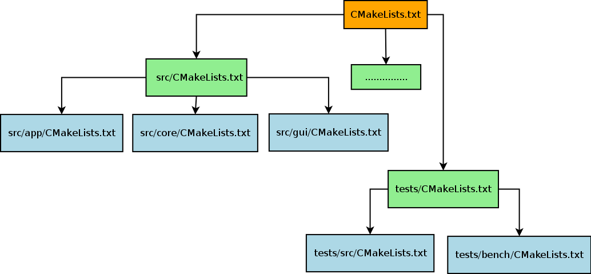

Environnement de développement (1)
==================================

|

**Compilateur**

Sous GNU/Linux: g++

.. code-block:: bash

  $ g++ main.cpp

Construction d'une librairie partagée et linkage :

.. code-block:: bash

  $ gcc -Wall -fPIC -c mylib.c
  $ gcc -shared -Wl,-soname,libmylib.so.1 -o libmylib.so.1.0 mylib.o
  $ g++ main.cpp -L lmylib.so

Environnement de développement (2)
==================================

|

**EXERCICE 1**

|

.. image:: imgs/exo.png
  :width: 200pt
  :align: center

Environnement de développement (3)
==================================

**git**

- git clone <url>
- git branch <branch_name>
- git checkout <branch_name>
- git remote add <remote_nickname> <remote_url>
- git fetch <remote_nickname>
- git merge <remote_nickname>/<branch_name>
- git add <file>
- git commit -m "message"
- git push origin <branch_name>
- git pull
- git rebase -i HEAD~<number_of_commits>

Environnement de développement (4)
==================================

|

**git : workflow QGIS simple**

.. code-block:: bash

  $ git clone https://github.com/username/QGIS # clone d'un fork
  $ git branch new_feature
  $ git checkout new_feature
  ......
  $ git add ...
  $ git commit -m "[FEATURE] my new feature description"
  $ git push origin new_feature
  .....
  $ git checkout master
  $ git remote add upstream https://github.com/qgis/QGIS
  $ git fetch upstream
  $ git merge upstream/master
  ....
  $ git checkout new_feature
  $ git rebase master
  $ git push -f origin new_feature

Environnement de développement (5)
==================================

|

https://www.qgis.org/en/site/getinvolved/development/qgisdevelopersguide/codingstandards.html

**git : hook**

Pour vérifier automatiquement les coding rules QGIS à chaque commit :

.. code-block:: bash

  $ ln -s scripts/prepare-commit.sh .git/hooks/pre-commit

Environnement de développement (6)
==================================

|

**git : hook**

.. code-block:: bash

  $ git add file_badly_indented.cpp
  $ git commit
  flip not found
  formatted  file_badly_indented.cpp
  Files changed (see astyle.c68eaeb92923638518e802baf410d55eed766f37.diff)
  $ git status
  On branch master
  Your branch is up-to-date with 'origin/master'.
  Changes to be committed:
    (use "git reset HEAD <file>..." to unstage)

      modified:   file_badly_indented.cpp

  Changes not staged for commit:
    (use "git add <file>..." to update what will be committed)
    (use "git checkout -- <file>..." to discard changes in working directory)

      modified:   file_badly_indented.cpp

Environnement de développement (7)
==================================

|

**CMake : architecture QGIS**

Environnement de développement (8)
==================================

|

**CMake : compilation**

.. code-block:: bash

  $ mkdir build && cd build
  $ cmake .. -DCMAKE_INSTALL_PREFIX=/usr/local
  $ make -jN

**CMake : installation/désinstallation**

.. code-block:: bash

  $ sudo make install
  $ sudo xargs rm < install_manifest.txt

Environnement de développement (9)
==================================

|

**CMake : ccmake**

.. image:: imgs/ccmake.png
  :width: 2000pt
  :align: center

Environnement de développement (10)
===================================

|

**CMake : compilation QGIS**

.. code-block:: bash

  $ cd <QGIS-DIR>
  $ mkdir -p ~/myapps
  $ mkdir build && cd build
  $ ccmake ..
  .....
  $ make -jN
  $ make install

- CMAKE_BUILD_TYPE : Debug
- CMAKE_INSTALL_PREFIX : /home/username/myapps/qgis-fork-master
- WITH_ASTYLE : ON

La dernière option permet de réparer des fichiers mal indentés
et DÉJÀ commités grâce au script *scripts/astyle.sh*.

Environnement de développement (11)
===================================

**CMake : variable d'environnement**

.. code-block:: cmake

  SET(LIBHELLO_DIR ${CMAKE_SOURCE_DIR}/src/lib)

**CMake : ajouter un sous répertoire ayant un CMakeLists.txt**

.. code-block:: cmake

  ADD_SUBDIRECTORY(src)

**CMake : compiler une librairie partagée**

.. code-block:: cmake

  ADD_LIBRARY(hello SHARED ${SOURCES})

**CMake : compiler un exécutable**

.. code-block:: cmake

  ADD_EXECUTABLE(main ${MAIN_SOURCES})

Environnement de développement (12)
===================================

|

**CMake : link avec une librairie**

.. code-block:: cmake

  LINK_DIRECTORIES(${LIBHELLO_DIR})
  TARGET_LINK_LIBRARIES(main hello)

**CMake : ajouter un chemin d'include**

.. code-block:: cmake

  INCLUDE_DIRECTORIES(${LIBHELLO_DIR})

**CMake : installer une librairie**

.. code-block:: cmake

  INSTALL(TARGETS hello DESTINATION lib)

Environnement de développement (13)
===================================

|

**EXERCICE 2**

|

.. image:: imgs/exo.png
  :width: 200pt
  :align: center
