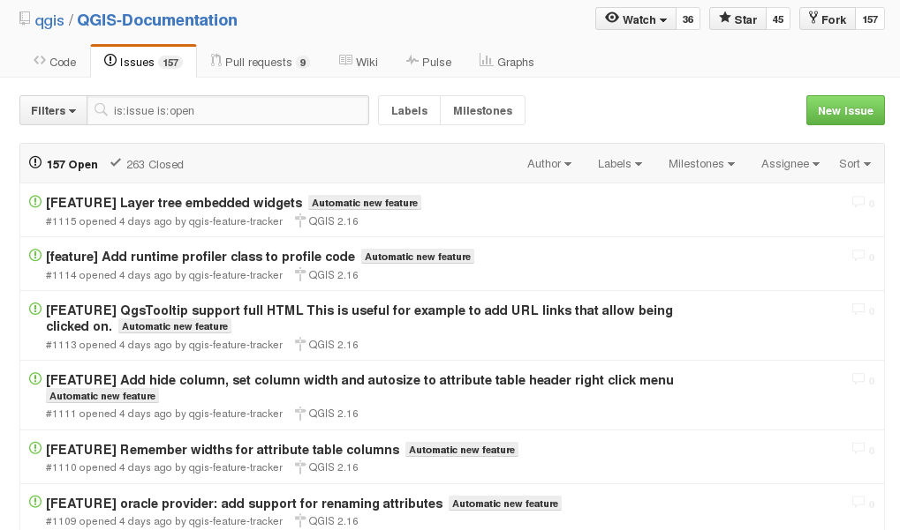

QGIS
====

|

.. image:: imgs/qgis-icon.png
  :width: 300pt
  :align: center

API QGIS (1)
============

|

.. image:: imgs/qgis.png
  :width: 2000pt
  :align: center

API QGIS (2)
============

|

**map**

- QgsMapCanvas : widget d'affichage de la carte
- QgsMapRenderer / QgsMapRendererJob : rendu de la carte
- QgsMapTool : intéractions utilisateur avec la carte (déplacement, identification de feature, ...)
- QgsMapLayer : les couches (vector, raster, ...)

**feature**

- QgsFeature : objets géographiques
- QgsFeatureRenderer : rendu de feature
- QgsGeometry : géometrie (point, polygone, ...)

API QGIS (3)
============

|

**divers**

- QgsProject : ouverture / lecture / ... de fichier .qgis
- QgsLayerTreeGroup : arbre des couches
- QgisInterface : point d'entrée des plugins Python

**Beaucoup de classes!!**

Dépôt QGIS (1)
==============

|

https://github.com/qgis/QGIS

.. image:: imgs/qgis_repo.png
  :width: 2000pt
  :align: center

Dépôt QGIS (2)
==============

**Racine**

- **ci** : continuous integration (scripts travis pour linux, OSX, QT4, QT5)
- **cmake** : scripts CMake
- **debian** - mac - ms-windows - rpm : le nécessaire pour faire les packages
- **doc** : auteurs, contributeurs, ...
- **i18n** : langues
- **images/themes/default** : icones, ...
- **python** : binding (.sip), ...
- **scripts** : des scripts utiles (pre-commit.sh, astyle.sh, ...)
- **src** : les sources QGIS
- **tests** : le nécessaire pour les tests unitaires (sources, données de tests, ...)

Dépôt QGIS (3)
==============

|

**src : les répertoires principaux**

- **app** : maptools "spécifiques" (pin/unpin labels, ...), le main!
- **core** : expression, maplayer, renderer, datadefined, ...
- **customwidgets** : les widgets custom réutilisables (QgsSpinBox)
- **gui** : les maptools de base, mapcanvas, messagebar, attributeform, ...
- **plugins** : les plugin C++
- **providers** : les dataproviders (memory, postgres, virtual, ...)
- **ui** : les fichiers .ui

QGIS Standalone (1)
===================

|

**Application sans GUI**

.. code-block:: C++

  #include <QApplication>
  #include <qgsapplication.h>

  int main(int argc, char *argv[])
  {
    QgsApplication app(argc, argv);
    app.setPrefixPath("/usr/local", true);
    app.init();
    app.initQgis();

    app.exitQgis();

    return 0;
  }

QGIS Standalone (2)
===================

|

**Application avec GUI**

.. code-block:: C++

  #include <qgsapplication.h>
  #include <qgsmapcanvas.h>

  int main(int argc, char *argv[])
  {
    QgsApplication app(argc, argv);
    app.setPrefixPath("/usr/local", true);
    app.init();
    app.initQgis();

    QgsMapCanvas canvas;
    canvas.show();

    int rc = app.exec();
    app.exitQgis();

    return rc;
  }

QGIS Standalone (3)
===================

|

**EXERCICE 4**

|

.. image:: imgs/exo.png
  :width: 200pt
  :align: center

Intégration continue
====================

|

Lors d'une PR, les builds sont réalisés sur plusieurs OS : Linux, OSX et Windows.

http://dash.orfeo-toolbox.org/index.php?project=QGIS

Un build va échouer si :
  - il y a des erreurs/warnings de compilation
  - des tests unitaires ne passent pas
  - il y a un problème dans le binding Python
  - la documentation est incomplète
  - ...

QGIS documentation (1)
======================

|

**header**

.. code-block:: C++

  /***************************************************************************
  <filename>
  begin                : <month> <year>
  copyright            : (C) <year> <Prenom> <Nom>, <Entrprise>
  email                : <mail>
  ***************************************************************************/

  /***************************************************************************
  *                                                                         *
  *   This program is free software; you can redistribute it and/or modify  *
  *   it under the terms of the GNU General Public License as published by  *
  *   the Free Software Foundation; either version 2 of the License, or     *
  *   (at your option) any later version.                                   *
  *                                                                         *
  ***************************************************************************/

QGIS documentation (2)
======================

|

**doxygen**

.. code-block:: C++

  /** Description de la méthode.
   * \param nom description du paramètre1
   * \param nom description du paramètre2
   * \returns description de la valeur de retour
   * \note added in QGIS 3.X
   */

Documenter tout ce qui est public ou protected au minimum!!

QGIS documentation (3)
======================

https://github.com/qgis/QGIS-Documentation

Documentation à compléter lors de l'ajout d'une feature!

**[FEATURE] My new feature** : création automatique d'issue

QGIS documentation (3)
======================

|

**changelog**

http://changelog.qgis.org/en/qgis/

.. image:: imgs/changelog.png
  :width: 600pt
  :align: center

QGIS unit tests (1)
===================

|

**C++ : unit class test**

.. code-block:: C++

  #include <QtTest/QtTest>

  class TestQgsMyClass : public QObject
  {
    Q_OBJECT

    public:
      TestQgsMyClass() {}

    private slots:
      void initTestCase(); // executed before the first test function
      void cleanUpTestCase(); // executed after the last test function

      void testfunction1();
      void testfunction2();
  };

  QTEST_MAIN( TestQgsMyClass )

QGIS unit tests (2)
===================

|

**C++ : QGIS environment**

.. code-block:: C++

  void TestQgsMyClass::initTestCase()
  {
    QgsApplication::init();
    QgsApplication::initQgis(); // if needed
  }

  void TestQgsMyClass::cleanUpTestCase()
  {
    QgsApplication::exitQgis(); // if needed
  }

  void TestQgsMyClass::testfunction1()
  {
    QVERIFY( boolean predicate );
    QCOMPARE( checked_value, waited_value );

    QgsRenderChecker checker;
    checker.compareImages(....);
  }

QGIS unit tests (3)
===================

|

**Python : unittest**

.. code-block:: python

  from qgis.testing import (start_app,
                            unittest)
  from utilities import unitTestDataPath

  start_app()
  TEST_DATA_DIR = unitTestDataPath()

  class TestQgsClass(unittest.TestCase):

    def __init__(self, methodName):
      unittest.TestCase.__init__(self, methodName)

    def test1(self):
      self.assertEqual(...)
      self.assertTrue(....)
      self.assertAlmostEqual(....)

  if __name__ == '__main__':
    unittest.main()

QGIS unit tests (4)
===================

|

**Python : interface**

Mock object pour **QgisInterface** : *python/testing/mocked.py*

.. code-block:: python

  from qgis.testing.mocked import get_iface

  my_iface = get_iface()

QGIS Python binding (1)
=======================

**SIP**

Recopie du **.h** sauf :

  - mot clé override
  - implémentation
  - les includes
  - les éléments private

En plus :

.. code-block:: C++

  class QgsMapRendererJob : QObject
  {
    %TypeHeaderCode
    #include <qgsmaprendererjob.h>
    %End

    ........

QGIS Core-Dev
=============

|

**EXERCICE 5**

|

.. image:: imgs/exo.png
  :width: 200pt
  :align: center

