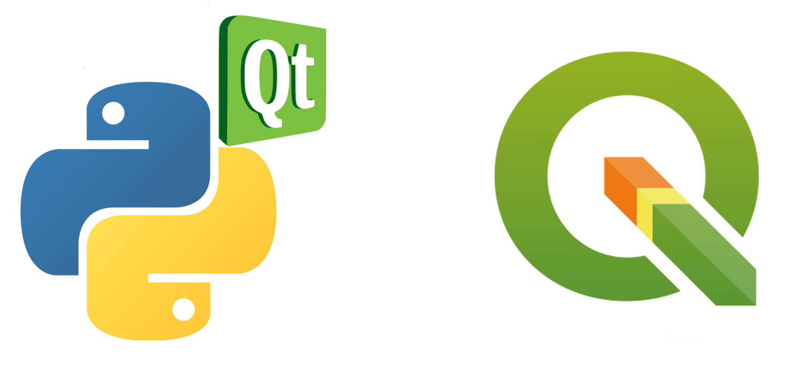

==================================
Développement QGIS - Plugin Python
==================================
|
|
**Paul Blottiere**

**Décembre 2017**

Plan de la formation
====================

**Jour 1**
  - Python
  - PyQT

**Jour 2**
  - PyQT - suite
  - PyQGIS / Plugin QGIS

**Jour 3**
  - PyQGIS / Plugin QGIS - suite

.. include:: python.rst
.. include:: qt.rst
.. include:: qgis.rst
