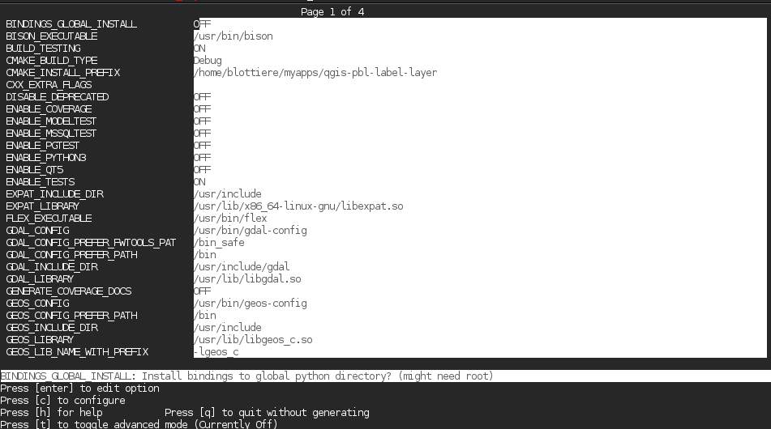

========================
Développement QGIS - C++
========================
|
|
**Paul Blottiere**

**Juin 2016**

Plan de la formation
====================

**Jour 1**
  - C++ (rappels)
  - Environnement de développement (compilateur, CMake, git)
  - QT

**Jour 2**
  - API QGIS
  - Architecture du dépôt QGIS
  - Développement d'une application standalone QGIS

**Jour 3**
  - Documentation (Doxygen, QGIS-Documentation, changelog)
  - Binding Python
  - Tests unitaires
  - Core dev

Rappels de C++ (1)
==================

|

.. image:: imgs/bjarne.png
  :width: 140pt
  :align: center

- 1983 - Bjarne Stroustrup (Danois)
- Langage compilé orienté objet (et procédural)
- Typage statique
- Pas de garbage collector
- C++ 99 → C++ 11 → C++ 14 → C++ 17

Rappels de C++ (2)
==================

|

.. image:: imgs/cppenv.png
  :width: 1500pt
  :align: center

Rappels de C++ (3)
==================

|

**main**

.. code-block:: C++

  #include "hello.h"

  int main( int argc, char** argv)
  {
    Hello h1( 1 );
    h1.print();

    const n2 = 2;
    Hello *h2 = new Hello( n2 );
    h2->print();
    delete h2;

    return 0;
  }

.. code-block:: bash

  $ ./main
  Hello 1
  Hello 2

Rappels de C++ (4)
==================

|

**Header** : déclaration

.. code-block:: C++

  #ifndef HELLO_H
  #define HELLO_H

  class Hello
  {
    public:
      Hello( int number );
      ~Hello();

      void print() const;

    private:
      int mNumber;
  }

  #endif

Rappels de C++ (5)
==================

|

**Source** : implémentation

.. code-block:: C++

  #include <iostream>
  #include "hello.h"

  Hello::Hello( int number )
    : mNumber( number )
  {
  }

  Hello::~Hello()
  {
  }

  void Hello::print()
  {
    std::cout << "Hello " <<  mNumber << std::endl;
  }

Rappels de C++ (6)
==================

|

**Méthode virtuelle pure ⟶ Classe abstraite**

.. code-block:: C++

  class HelloV2
  {
    public:
      Hello( const std::string &word );
      virtual ~Hello();

      virtual void print() const = 0;

    protected:
      void hello();

    private:
      QString mWord;
  }

Rappels de C++ (7)
==================

|

**Méthode virtuelle pure ⟶ Classe abstraite**

.. code-block:: C++

  HelloV2::HelloV2( const std::string &word )
    : mWord( word )
  {
  }

  HelloV2::~HelloV2()
  {
  }

  void HelloV2::hello()
  {
    std::cout << "Hello " << mWord << "!" << std::endl;
  }

Rappels de C++ (8)
==================

|

**Héritage**

.. code-block:: C++

  class HelloWorldV2 : public HelloV2
  {
    public:
      HelloWorldV2();
      ~HelloWorldV2();

      void print() const override;
  }

Rappels de C++ (9)
==================

|

**Héritage**

.. code-block:: C++

  HelloWorldV2::HelloWorldV2()
    : HelloV2( "world!" )
  {
  }

  HelloWorldV2::~HelloWorldV2()
  {
  }

  void HelloWorldV2::print()
  {
    std::cout << "HelloWorldV2 print: " << std::endl;
    this.hello();
  }

Rappels de C++ (10)
===================

|

**Surcharge**

.. code-block:: C++

  class Printer
  {
    void hello( const HelloWorldV2 &h ) { h.print(); }
    void hello( const Hello &h ) { h.print() ); }
  }

.. code-block:: C++

  int main( int argc, char** argv )
  {
    Hello h1( 10 );
    Printer::hello( h1 );

    HelloWorldV2 h2;
    Printer::hello( h2 );
  }

Rappels de C++ (11)
===================

|

**EXERCICE 1**

|

.. image:: imgs/exo.png
  :width: 200pt
  :align: center

Environnement de développement (1)
==================================

|

**Compilateur**

Sous GNU/Linux: g++

.. code-block:: bash

  $ g++ main.cpp

Construction d'une librairie partagée et linkage :

.. code-block:: bash

  $ gcc -Wall -fPIC -c mylib.c
  $ gcc -shared -Wl,-soname,libmylib.so.1 -o libmylib.so.1.0 mylib.o
  $ g++ main.cpp -L lmylib.so

Environnement de développement (2)
==================================

**git**

- git clone <url>
- git branch <branch_name>
- git checkout <branch_name>
- git remote add <remote_nickname> <remote_url>
- git fetch <remote_nickname>
- git merge <remote_nickname>/<branch_name>
- git add <file>
- git commit -m "message"
- git push origin <branch_name>
- git pull
- git rebase -i HEAD~<number_of_commits>

Environnement de développement (3)
==================================

|

**git : workflow QGIS simple**

.. code-block:: bash

  $ git clone https://github.com/username/QGIS # clone d'un fork
  $ git branch new_feature
  $ git checkout new_feature
  ......
  $ git add ...
  $ git comit -m "[FEATURE] my new feature description"
  $ git push origin new_feature
  .....
  $ git checkout master
  $ git remote add upstream https://github.com/qgis/QGIS
  $ git fetch upstream
  $ git merge upstream/master
  ....
  $ git checkout new_feature
  $ git rebase master

Environnement de développement (5)
==================================

|

**CMake : architecture QGIS**

.. image:: imgs/cmake_qgis.png
  :width: 2000pt
  :align: center

Environnement de développement (6)
==================================

|

**CMake : compilation**

.. code-block:: bash

  $ mkdir build && cd build
  $ cmake .. -DCMAKE_INSTALL_PREFIX=/usr/local
  $ make -jN

**CMake : installation/désinstallation**

.. code-block:: bash

  $ sudo make install
  $ sudo xargs rm < install_manifest.txt

Environnement de développement (7)
==================================

|

**CMake : ccmake**

Environnement de développement (7)
==================================

|

**CMake : compilation QGIS**

.. code-block:: bash

  $ cd <QGIS-DIR>
  $ mkdir -p ~/myapps
  $ mkdir build && cd build
  $ ccmake ..
  .....
  $ make -jN
  $ make install

- CMAKE_BUILD_TYPE : Debug
- CMAKE_INSTALL_PREFIX : /home/username/myapps/qgis-fork-master
- WITH_QWTPOLAR : OFF

Environnement de développement (8)
==================================

|

**CMake : syntaxe**

Environnement de développement (9)
==================================

|

**CMake : syntaxe**

Environnement de développement (10)
===================================

|

**EXERCICE 2**

|

.. image:: imgs/exo.png
  :width: 200pt
  :align: center
