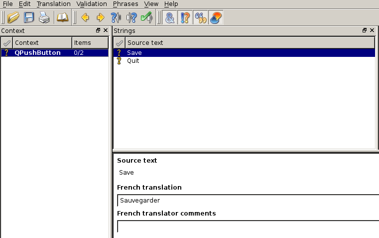

QT (1)
======

|

.. image:: imgs/qt.png
  :width: 150pt
  :align: center

- 1995
- multiplateforme
- libre depuis QT4
- widgets graphiques, signaux/slots, macros, patterns, ...

QT (2)
======

|

**main**

.. code-block:: C++

  #include <QApplication>
  #include <QTextEdit>

  int main( int argc, char** argv )
  {
    QApplication app( argv, argc );

    QPushButton button;
    button.setText( "Quit" );
    button.setToolTip( "Quit tooltip" );
    button.show();

    return app.exec();
  }

QT (3)
======

|

**slot/signal : utilisation**

.. code-block:: C++

  QObject::connect( button, SIGNAL( clicked() ), app, SLOT( quit() ) );

**slot/signal : déclaration dans le header**

.. code-block:: C++

  class CustomButton : public QPushButton
  {
    Q_OBJECT

    public:
      CustomButton();
      ~CustomButton();

    signal:
      void onQuitDone();

    private slots:
      void onQuit();
  }

QT (4)
======

|

**translate - TS file**

.. code-block:: xml

  <?xml version="1.0" encoding="utf-8"?>
  <!DOCTYPE TS>
  <TS version="2.0" language="fr_FR">
    <context>
      <name>QPushButton</name>
      <message>
        <source>Save</source>
        <translation>Sauvegarder</translation>
      </message>
    </context>
  </TS>

QT (5)
======

**translate - linguist**

QT (6)
======

|

**translate - QTranslator**

.. code-block:: C++

  QApplication app( argc, argv );

  QTranslator translator;
  translator.load(qm_file);
  app.installTranslator( &translator );

  QPushButton button( QObject::tr( "Hello world!" ) );

QT (7)
======

**CMake - détection de QT**

.. code-block:: cmake

  FIND_PACKAGE(Qt4 REQUIRED)

**CMake - link**

.. code-block:: cmake

  INCLUDE(${QT_USE_FILE})
  ADD_DEFINITIONS(${QT_DEFINITIONS})

  TARGET_LINK_LIBRARIES(myexe ${QT_LIBRARIES})

**CMake - moc**

.. code-block:: cmake

  SET(MYLIB_HEADERS
    ${MYLIB_DIR}/file_qobject.h)

  QT4_WRAP_CPP(MYLIB_MOC ${MYLIB_HEADERS})

  ADD_EXECUTABLE(myexe ${SOURCES} ${MYLIB_MOC})

QT (8)
======

**CMake - translation**

.. code-block:: cmake

  MACRO(ADD_TRANSLATION_FILES _sources )
    FOREACH (_current_FILE ${ARGN})
      GET_FILENAME_COMPONENT(_in ${_current_FILE} ABSOLUTE)
      GET_FILENAME_COMPONENT(_basename ${_current_FILE} NAME_WE)

      SET(_out ${CMAKE_BINARY_DIR}${CMAKE_DATA_DIR}/i18n/${_basename}.qm)

      ADD_CUSTOM_COMMAND(
      OUTPUT ${_out}
      COMMAND ${QT_LRELEASE_EXECUTABLE}
      ARGS -verbose ${_in} -qm ${_out}
      DEPENDS ${_in}
      )

      SET(${_sources} ${${_sources}} ${_out} )
    ENDFOREACH (_current_FILE)
  ENDMACRO(ADD_TRANSLATION_FILES)

  # make sure the output directory exists
  file(MAKE_DIRECTORY ${CMAKE_BINARY_DIR}${CMAKE_DATA_DIR}/i18n)

  SET(TS_FILES texts_fr.ts texts_es.ts)
  ADD_TRANSLATION_FILES (QM_FILES ${TS_FILES})

QT (9)
======

|

**smart pointer - QScopedPointer**

.. code-block:: C++

  MyClass *myClass = new MyClass();
  myClass->print();
  delete myClass;

  QScopedPointer< MyClass > myClass;
  myClass.reset( new MyClass() );
  myClass.data()->print();

QT (10)
=======

|

**EXERCICE 3**

|

.. image:: imgs/exo.png
  :width: 200pt
  :align: center
