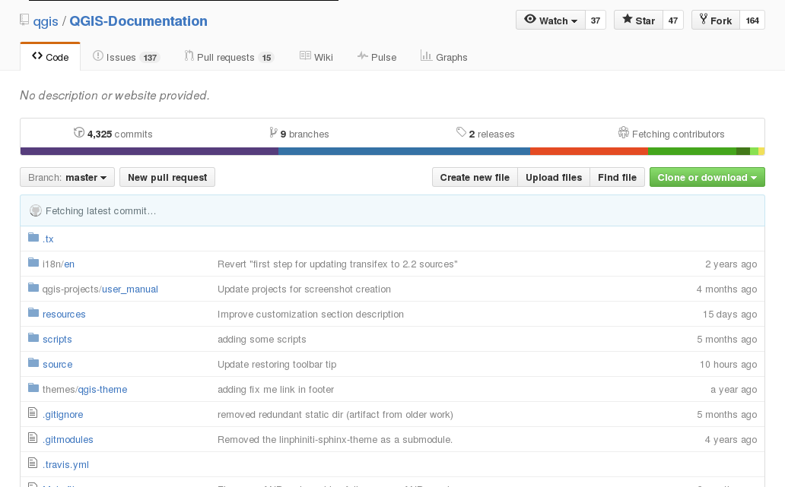

Information (1)
===============

De nombreuses sources d'information :

  - Documentation : http://www.qgis.org/fr/docs/
  - Tutoriaux : http://www.qgistutorials.com/fr/, http://www.ades.cnrs.fr/tutoqgis/
  - Contribuer : https://github.com/qgis/QGIS-Documentation

Information (2)
===============

Remontée de bug : https://www.qgis.org/fr/site/getinvolved/development/bugreporting.html

Mailing lists : https://www.qgis.org/fr/site/getinvolved/mailinglists.html#qgis-mailinglists

|
.. image:: imgs/bugreport.png
  :width: 700pt
  :align: center

Information (3)
===============

|
Dépôt de plugin : http://plugins.qgis.org/plugins/

|
.. image:: imgs/pluginrepo.png
  :width: 700pt
  :align: center
