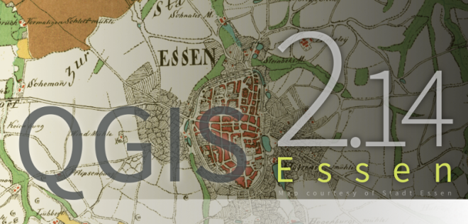

Présentation (1)
================

http://www.qgis.org/fr/site/

- Développement débuté en 2002
- Logiciel SIG libre multiplate-forme
- Quantum GIS -> version 1.9

Présentation (2)
================
|
**De nombreux formats supportés**

- Raster (GeoTIFF, JPG, PNG, ...)
- Vecteur ( Shapefile, GRASS GIS, Mapinfo, ... )
- Base de données spatiale ( Postgis, SpatiaLite )
|

Présentation (3)
================
**LTR**

- LTR courante : 2.14.3 / Essen
- Sortie en 20/05/ 2016
- Bientôt la 2.16!

|

