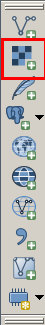

Les couches raster (1)
======================

**Les bases**

- Matrice de cellules
- Photographies aériennes, images satellites, ...
- Géoréférencées grâce à la position des pixels

Les couches raster (2)
======================

**Propriétés**

.. image:: imgs/ratser_prop.png
  :width: 450pt
  :align: center

Les couches raster (3)
======================

|
De nombreux algorithmes de traitement disponibles dans QGIS et via *Processing* :
  - extraction, contour, analyse, ...
  - GRASS GIS 7 ( r.to.vect, r.watershed, ... )

|
.. image:: imgs/raster_algo.png
  :width: 300pt
  :align: center

Les couches raster (4)
======================

|
.. image:: imgs/exo.png
  :width: 100pt
  :align: center

|
**1** - Récupérer les données ici : https://github.com/spatialthoughts/qgis-tutorials/blob/master/downloads/GMTED2010N10E060_300.zip

**2** - Charger le fichier raster *10n060e_20101117_gmted_mea300.tif* dans QGIS

**3** - Extraire une partie du raster en faisant un drag de la bounding box dans le canvas

**4** - Extraire les contours tous les 100 mètres avec un export de l'altitude dans le champs *ELEV*

Les couches raster (5)
======================

|
.. image:: imgs/exo.png
  :width: 100pt
  :align: center

|
**5** - Ajouter un point dans une couche virtuelle à la position du mont Everest grâce à la commande suivante (*x* et *y* doivent être en degrés décimaux) :

.. code-block:: C++

  SELECT 1 as id, MakePoint(x, y, 4326) as geom

**6** - Labeliser la couche contour avec l'élévation et vérifier que le mont Everest se trouve bien à l'altitude maximale

Les couches raster (6)
======================

|
.. image:: imgs/exo.png
  :width: 100pt
  :align: center

**7** - Installer et utiliser le plugin *Terrain profile* pour récupérer une courbe de profile au niveau du mont Everest

**8** - Styliser le raster avec le type de rendu "Singleband pseudocolor" et
utiliser les couleurs de la palette topographique *sda*

Les couches raster (7)
======================

|
.. image:: imgs/raster_sda.png
  :width: 700pt
  :align: center

Les couches raster (8)
======================

|
.. image:: imgs/exo.png
  :width: 100pt
  :align: center

**9** - Créer un hillshade à partir du raster : Raster -> Analyse -> DEM.

**10** - Jouer avec les paramètres de rendu (transparence, luminosité, ...) pour donner du relief au raster grâce au hillshade :

.. image:: imgs/raster_hillshade.png
  :width: 400pt
  :align: center
