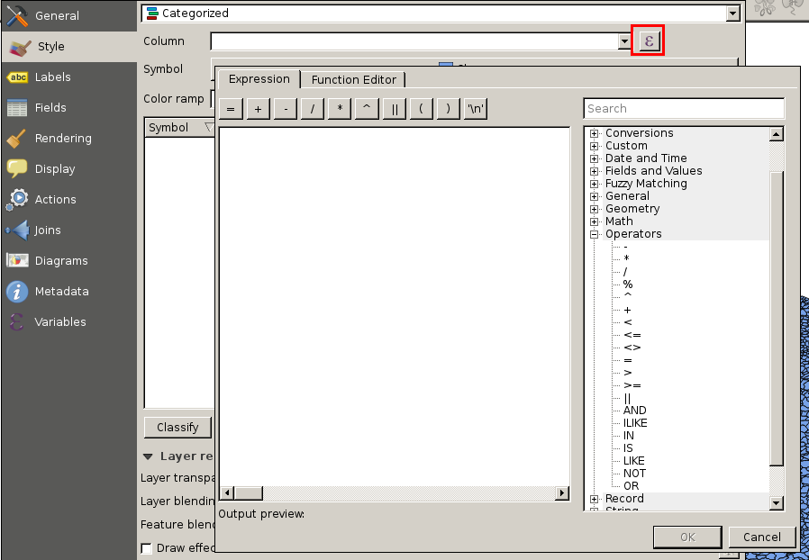
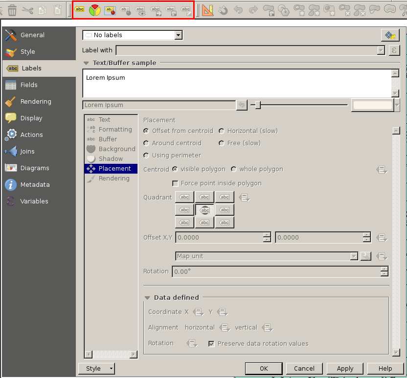

Les couches vecteur (1)
=======================

|

**Les bases**

- Définies par des coordonnées
- 3 types de géométrie : *point*, *ligne* et *polygone*
- 1 seul type de géométrie par layer
- Données attributaires : données associées à la composante spatiale
- 69 formats gérés (lib OGR) : format standard QGIS est le shapefile ESRI

|

http://www.gdal.org/ogr_formats.html

Les couches vecteur (2)
=======================

|
**Charger un shapefile**

|
.. image:: imgs/select_vector.png
  :width: 400pt
  :align: center

Les couches vecteur (3)
=======================

**Propriétés**

.. image:: imgs/vector_prop.png
  :width: 500pt
  :align: center

Les couches vecteur (4)
=======================

**SCR**

Les coordonnées d'un point peuvent être exprimées :
  - en degrés dans un système géodésique de référence
  - en mètres suite à une projection (coordonnes 3D -> surface plane)

|
Système de Coordonnées de Référence : système de coordonnées + projection

|
.. image:: imgs/vector_crs.png
  :width: 600pt
  :align: center

Les couches vecteur (5)
=======================

|
**Symbologie**

- Apparence visuelle  sur la carte
- Couleur, visibilité dépendante de l'échelle, positionnement, ...
- Analyse thématique ( illustration de carte )

|

Les couches vecteur (6)
=======================

**Expressions**

Analyse syntaxique d'expression :
  - évaluation en prédicats booléens ou comme des fonctions
  - nombre, texte, référence de colonnes
  - fonctions mathématiques, couleur, date/heure, ...

Les couches vecteur (7)
=======================

**Expressions - example**

.. code-block:: C++

  case
    when CODE_DEPT = 29 or CODE_DEPT = 53
    then
      POPULATION
    else
      0
  end

.. code-block:: C++

  if length ( NOM_COM ) > 15
  then
    '-'
  end

Les couches vecteur (8)
=======================

|
.. image:: imgs/exo.png
  :width: 100pt
  :align: center

**1** - Télécharger les données *SHP* https://www.data.gouv.fr/fr/datasets/geofla-communes/

**2** - Ouvrir QGIS, charger *COMMUNE.shp* et déterminer le SCR

**3** - Ouvrir la table d'attributs pour visualiser les informations disponibles

**3** - Changer les paramètres du style "Symbole Unique" :
  - mode de remplissage "simple"
  - changer la couleur de remplissage et de la bordure
  - changer le style de remplissage
  - changer le style de bordure

Les couches vecteur (9)
=======================

|
.. image:: imgs/exo.png
  :width: 100pt
  :align: center

**4** - Changer le style en "Catégorisé" et :
  - créer une catégorie selon le code de département
  - changer la palette de couleur
  - classer et visualiser
  - visualiser l'échelle dans l'arbre des couches

**5** - Catégoriser selon la densité de population

**6** - Sauvegarder le projet

Les couches vecteur (10)
========================

**Labels / Diagrammes**

Ajout d'étiquettes configurables en fonction de la géométrie :
  - texte
  - placement
  - affichage
  - couleur / ombre
  - ...

Les couches vecteur (11)
========================

|
.. image:: imgs/exo.png
  :width: 100pt
  :align: center

**1** - Ouvrir le project QGIS précédent

**2** - Labeliser la couche *COMMUNE* en mode "Montrer les étiquettes pour cette couche":
  - avec le code de département
  - changer la police
  - ajouter un cercle de couleur en fond des labels
  - ajouter une ombre au label
  - ajouter une règle pour ne visualiser les labels qu'à petites échelles

Les couches vecteur (12)
========================

|
.. image:: imgs/exo.png
  :width: 100pt
  :align: center

**3** - Passer en mode "Etiquettes basées sur des règles" :
  - la règle : afficher des labels seulement pour le département 29
  - les labels : multi-ligne indiquant le nom de la commune et la population
  - formatter les labels de telle sorte qu'on autorise un retour à la ligne sur le caractère "-" quand le nom de la commune excède un certain nombre de caractères

**4** - Data-defined :
  - ajuster la position de certain label à la main
  - forcer la visibilité de certain label

Les couches vecteur (13)
========================

**Formulaire**

- permet d'éditer les attributs d'une entité
- sélection automatique de l'entité sur la carte
- outil "Identifier les entités"

|
.. image:: imgs/identifier.png
  :width: 300pt
  :align: center

Les couches vecteur (14)
========================

**Actions**

Un utilisateur peut ajouter des actions personalisées sur une entité!

|
.. image:: imgs/action_config.png
  :width: 700pt
  :align: center

Les couches vecteur (15)
========================

|
.. image:: imgs/exo.png
  :width: 100pt
  :align: center

**1** - Ajouter un attribut "photo" à la couche *COMMUNE*

**2** - Indiquer dans les propriétés du champs qu'on veut utiliser un outil d'édition "Photo"

**3** - Utiliser l'outil "Identifier les entités" et attribuer des photos à quelques entités

**4** - Ajouter une action permettant d'ouvrir la photo de l'entité grâce à la syntaxe *[%"photo"%]*

**5** - Retourner sur la carte et visualiser les photos grâce à l'action définie

Les couches vecteur (16)
========================

**Opérations**

- intersection, différence, union, ...
- manipulation d'entité vectorielle "Barre d'outils de la numérisation avancée" ( entités vs parties, fusion, ... )
- de très nombreux algorithmes sont disponibles dans "La boite à outils de traitements"

Les couches vecteur (17)
========================

**Sélection par localisation**

.. image:: imgs/local_menu.png
  :width: 300pt
  :align: center

Les couches vecteur (18)
========================

|
**Requête spatiale**

.. image:: imgs/req_spatiale.png
  :width: 200pt
  :align: center

Les couches vecteur (19)
========================

|
**Requête spatiale 2**

|
.. image:: imgs/vector_tools.png
  :width: 700pt
  :align: center

Les couches vecteur (20)
========================

|
**Couche virtuelle**

- résultat d'une requête mélangeant SQL et Expression
- peut utiliser plusieurs couches vecteur
- les couches filles peuvent être embarquées dans la couche virtuelle

.. image:: imgs/virtual.png
  :width: 30pt
  :align: center

Les couches vecteur (21)
========================

|
**Couche virtuelle**

|
.. image:: imgs/virtual_conf.png
  :width: 400pt
  :align: center

Les couches vecteur (22)
========================

|
.. image:: imgs/exo.png
  :width: 100pt
  :align: center

**1** - Utiliser les outils suivant pour créer une couche vectorielle contenant seulement les départements frontaliers entre le Finistère et le reste de la France
  - couche virtuelle
  - géotraitement "Différence""
  - géotraitement "Tampon"
  - requête spatiale
