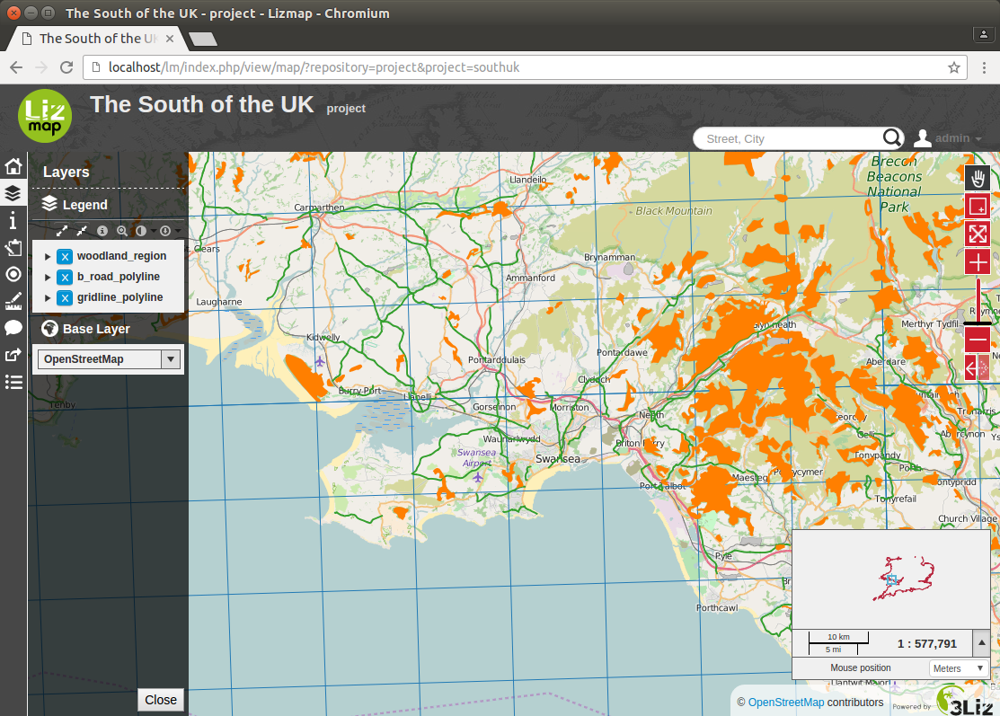
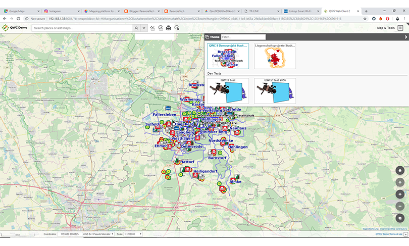
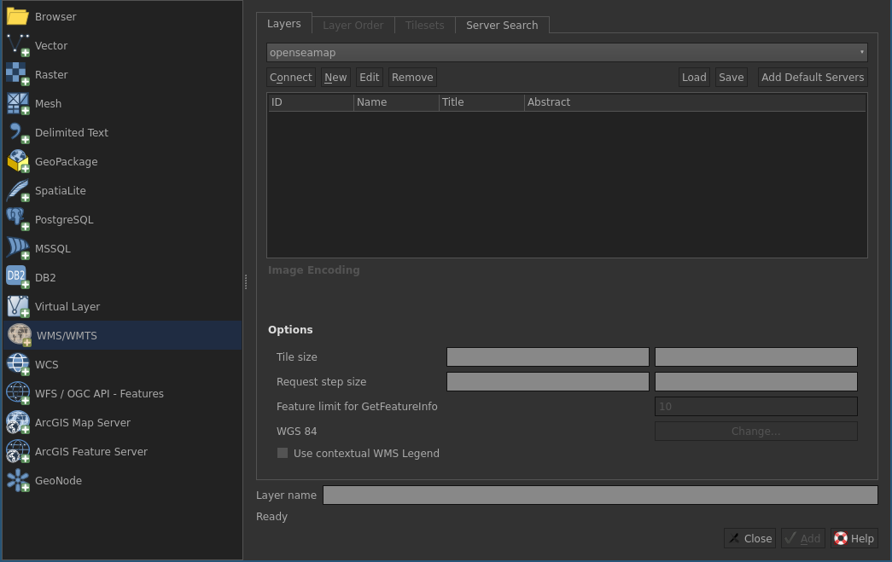

Clients (1)
===========
**WEB: LizMap (3Liz)**

|

Clients (2)
===========
**WEB: QWC2 (QGIS)**

|

Clients (3)
===========
**WEB: custom**

- flux WMS affichée dans une page HTML classique
- OpenLayers, Leaflet, ...

|
.. code-block::

    var map=new OpenLayers.Map(’map’);
    var layer=new OpenLayers.Layer.WMS(
      "Glacier fronts1",
      "http://qgis.sequanux.org/cgi-bin/project/landsat/qgis_mapserv.fcgi",
      {layers: "fronts4", transparent:"true", format:"image/png"},
      {isBaseLayer: false}
    );
    map.setCenter(new OpenLayers.LonLat(12,79),9);
    map.addLayer(layer);

Clients (4)
===========
**Lourd: QGIS Desktop**

|

