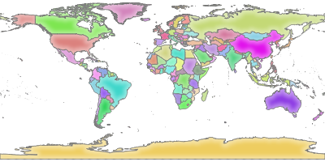

Installation (1)
================

|
OS cible:
  - Windows: installation compliquée et semée d'embuches
  - OSX: aucune idée...
  - GNU/Linux: OS conseillé

|
Diverses distributions GNU/Linux supportées:
  - Debian, Ubuntu, Fedora, ...

.. code-block::

  sudo apt-get install qgis-server

https://docs.qgis.org/3.4/en/docs/user_manual/working_with_ogc/server/getting_started.html

Installation (2)
================

|
Nécessite:
  - un serveur web (NGINX, Apache, ...)
  - en environnement graphique (serveur X)

.. code-block::

  http://localhost/qgisserver?
  MAP=/home/user/qgis-server-tutorial-data-master/world.qgs&
  LAYERS=countries&
  SERVICE=WMS&
  REQUEST=GetMap&
  CRS=EPSG:4326&
  WIDTH=400&
  HEIGHT=200

Installation (3)
================

|
|
|
|

