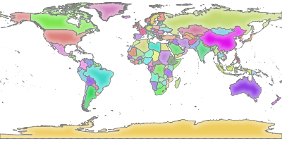

Services (1)
============

- WMS 1.1/1.3
- WFS 1.1
- WMTS 1.0
- WCS 1.0
- OGC API Features (aka WFS3): depuis QGIS 3.10

|
.. image:: imgs/OGC_LOGO_real.jpg
  :width: 250pt
  :align: center

Services (2)
============
**WMS**

Requêtes:

- norme OGC: **GetCapabilities**, **GetMap**, **GetLegendGraphics**, ...
- custom QGIS: **GetPrint**, **GetProjectSettings**, ...

|
Paramètres:

- norme OGC: **MAP**, **LAYERS**, **BBOX**, **CRS**/**SRS**, ...
- custom QGIS: **SHOWFEATURECOUNT**, **HIGHLIGHT_GEOM**, ...

Services (3)
============
**WMS**

.. code-block::

  http://localhost/qgisserver?
  MAP=/tmp/world.qgz&
  LAYERS=countries&
  SERVICE=WMS&
  REQUEST=GetMap&
  CRS=EPSG:4326&
  WIDTH=400&
  HEIGHT=200

Services (4)
============
**OGC API Features**

- protocole basé sur l'*openAPI* (XML -> JSON)
- landingPage: page html directement embarquée

|

